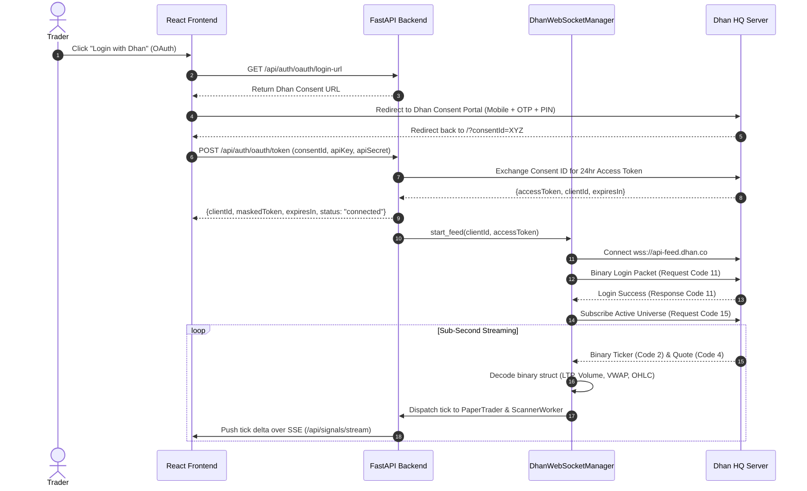

# Design Specification: Real-Time WebSockets Feed & Dhan OAuth 2.0 Login

**Date:** 2026-10-09  
**Status:** DRAFT  
**Scope:** Backend (`backend/app/services/dhan_websocket.py`, `backend/app/api/auth.py`), Frontend (`frontend/src/components/Header.tsx`, `frontend/src/context/DhanAuthContext.tsx`, `frontend/src/components/ConnectModal.tsx`).

---

## 1. Executive Summary

This feature replaces periodic HTTP polling (~3-8s) with a **sub-second Real-Time WebSocket Feed** directly connected to Dhan HQ (`wss://api-feed.dhan.co`). Additionally, it introduces an **OAuth 2.0 API Key & Secret Login Flow** alongside the existing manual token entry, handling 24-hour token expirations with session countdowns and automated re-authentication.

### Core Objectives
1. **Sub-Second Tick Processing**: Stream real-time ticks for Benchmark Indices, Top 10 Momentum F&O scrips, and Active Paper Option Contracts.
2. **Instant SL & Target Trailing**: Paper trading engine evaluates trailed SL and targets on every incoming option tick (0ms polling delay).
3. **OAuth 2.0 API Key Login**: Support 1-click "Connect with Dhan" via Dhan Consent API, exchanging authorization code for a 24-hour access token.
4. **Resilient Dual-Transport Fallback**: Automatic WebSocket reconnection with exponential backoff; seamless automatic failover to HTTP polling if socket connection drops.
5. **Zero-Token Persistence**: All credentials and tokens stay strictly in-memory on backend and in `sessionStorage` on frontend.

---

## 2. Architecture & System Flow



---

## 3. Detailed Component Specifications

### 3.1 Dhan OAuth 2.0 Integration (`backend/app/api/auth.py`)

#### Endpoints
1. `GET /api/auth/oauth/login-url`
   * **Query Params**: `app_id: str`, `redirect_uri: Optional[str]`
   * **Behavior**: Constructs official Dhan Consent Login URL:
     `https://auth.dhan.co/login/consent?client_id={app_id}&redirect_uri={redirect_uri}`
   * **Response**: `{"login_url": "https://auth.dhan.co/login/consent?..."}`

2. `POST /api/auth/oauth/token`
   * **Payload**:
     ```json
     {
       "app_id": "string",
       "app_secret": "string",
       "consent_id": "string"
     }
     ```
   * **Behavior**:
     Calls Dhan API token exchange endpoint: `POST https://auth.dhan.co/oauth/token` (or `https://api.dhan.co/v2/oauth/token`) with Basic/Body credentials.
     Receives `access_token` and `client_id`.
     Activates backend `ScannerWorker` and initializes `DhanWebSocketManager`.
   * **Response**:
     ```json
     {
       "status": "connected",
       "client_id": "1000000000",
       "masked_token": "eyJh...9c",
       "expires_in_hours": 24,
       "feed_mode": "websocket_live"
     }
     ```

### 3.2 Real-Time WebSocket Feed Manager (`backend/app/services/dhan_websocket.py`)

#### Connection & Packet Specifications
* **WebSocket Endpoint**: `wss://api-feed.dhan.co`
* **Packet Framing (Dhan HQ v2 Binary Format)**:
  * **Header**: 8-byte framing: `[FeedRequestCode (int16), MessageLength (int16), ExchangeSegment (uint8), SecurityId (int32)]`
  * **Packet Types**:
    * **Request Code 11 (Login)**: Client ID + Access Token binary authentication frame.
    * **Request Code 15 (Subscribe)**: Dynamic list of `(exchange_segment, security_id)`.
    * **Request Code 16 (Unsubscribe)**: Drop unneeded scrips.
    * **Response Code 2 (Ticker, 16 bytes)**: `[Code: 2, Len: 16, Seg: u8, SecId: i32, LTP: float32, LTT: i32]`.
    * **Response Code 4 (Quote, 50 bytes)**: `[Code: 4, Len: 50, Seg: u8, SecId: i32, LTP: float32, LTQ: i32, LTT: i32, AvgPrice: float32, Volume: i32, TotalBuy: i32, TotalSell: i32, Open: float32, High: float32, Low: float32, Close: float32]`.

#### In-Memory State & Dispatch
* Maintains `_live_ticks: dict[str, dict]` containing latest `{ltp, vwap, volume, high, low, timestamp}` for each subscribed security.
* On every option tick received for an active paper contract:
  - Invokes `paper_trader.update_market_prices(..., option_price_map={sec_id: ltp})`.
  - If trailed SL or target is hit, position closes immediately with zero scan-interval lag.
* On underlying spot tick:
  - Updates current forming candle in `scanner_worker`.

#### Resiliency & Auto-Reconnect
* **Ping / Pong**: Sends keepalive frame every 15 seconds.
* **Disconnect Handler**: Reconnects with exponential backoff: `[1s, 2s, 5s, 10s, 30s]`.
* **Fallback**: If WebSocket disconnected for $> 10\text{s}$, `ScannerWorker` automatically triggers HTTP polling cycle as fallback until WS reconnects.

### 3.3 Frontend Dashboard Enhancements (`frontend/`)

1. **Connect Modal (`ConnectModal.tsx`)**:
   * **Tab 1: 1-Click Dhan OAuth**:
     - Input fields: App ID & App Secret (stored only in browser `sessionStorage`).
     - Button: "Log in via Dhan" (redirects to official Dhan consent portal).
     - On redirect return: extracts `consentId` from URL query parameters, completes exchange automatically.
   * **Tab 2: Manual Access Token**:
     - Input fields: Client ID + Access Token (for direct 24-hr or 30-day tokens).
2. **Header Feed Badge (`Header.tsx`)**:
   * Green glowing badge: `⚡ WebSocket Live (Sub-second)` when WebSocket is active.
   * Amber badge: `HTTP Polling` when in fallback mode.
   * Session Timer Tooltip: "Dhan Token valid for: 21h 45m".
3. **Paper Portfolio & Signal Cards**:
   * Visual micro-flashes on price changes (green on uptick, red on downtick).
   * Real-time P&L updates without waiting for next scan countdown.

---

## 4. Testing & Verification Plan

1. **Unit Tests (`backend/tests/test_dhan_websocket.py`)**:
   * Test binary packet packer for Login Request (Code 11).
   * Test binary packet packer for Subscribe Request (Code 15).
   * Test binary unpacker for Ticker Packet (Code 2) and Quote Packet (Code 4).
   * Test WebSocket manager state transitions and reconnection backoff.
   * Test tick routing directly into paper trader without dropped packets.
2. **OAuth Unit Tests (`backend/tests/test_oauth_auth.py`)**:
   * Test `/api/auth/oauth/login-url` generation.
   * Test `/api/auth/oauth/token` exchange with mock Dhan OAuth server.
   * Test invalid consent ID and 401 handling.
3. **End-to-End Regression**:
   * Verify all existing 132 tests in `backend/tests/` remain 100% passing.
   * Verify frontend build passes cleanly (`npm run build`).
